# Page Designs Documentation

## Researcher Dashboards
- 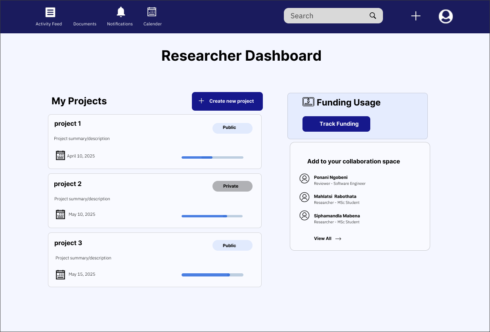  
  Main dashboard view for researchers
- 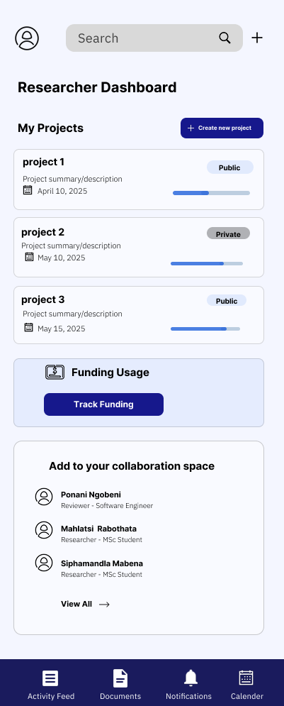  
  Responsive layout for smaller screens
-   
  Updated version of the researcher dashboard

## Admin Dashboards
- 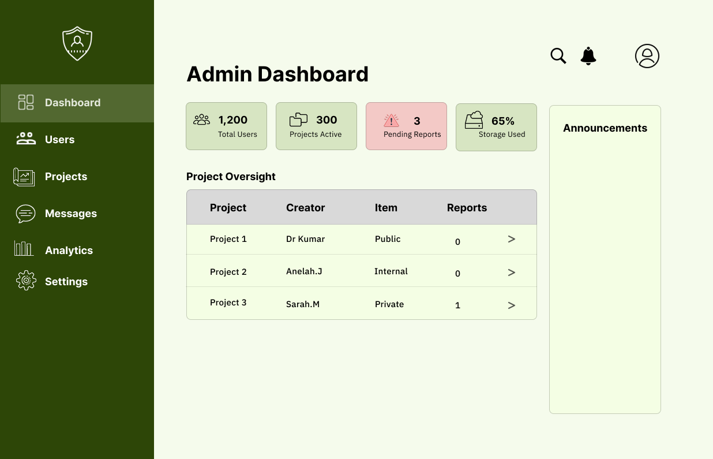  
  Main administrative interface
- 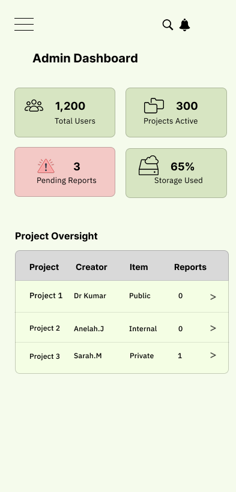  
  Mobile-responsive admin interface

## Project Management
- 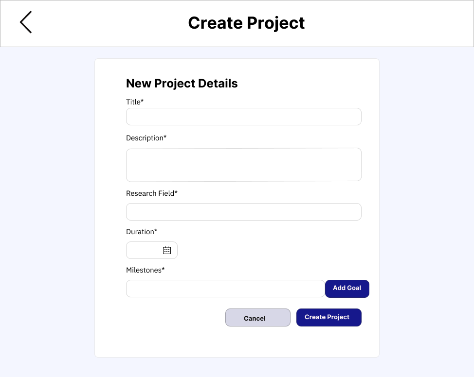  
  Interface for creating new projects
- 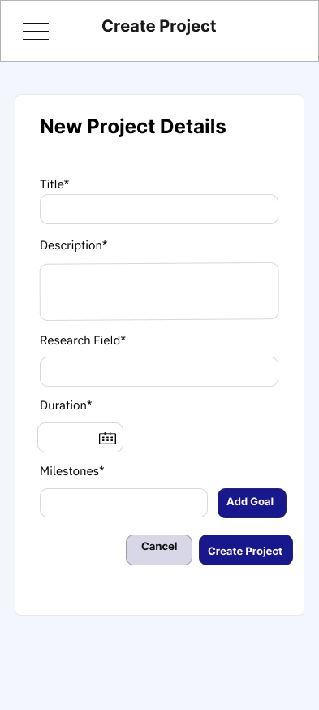  
  Mobile view for project creation
- 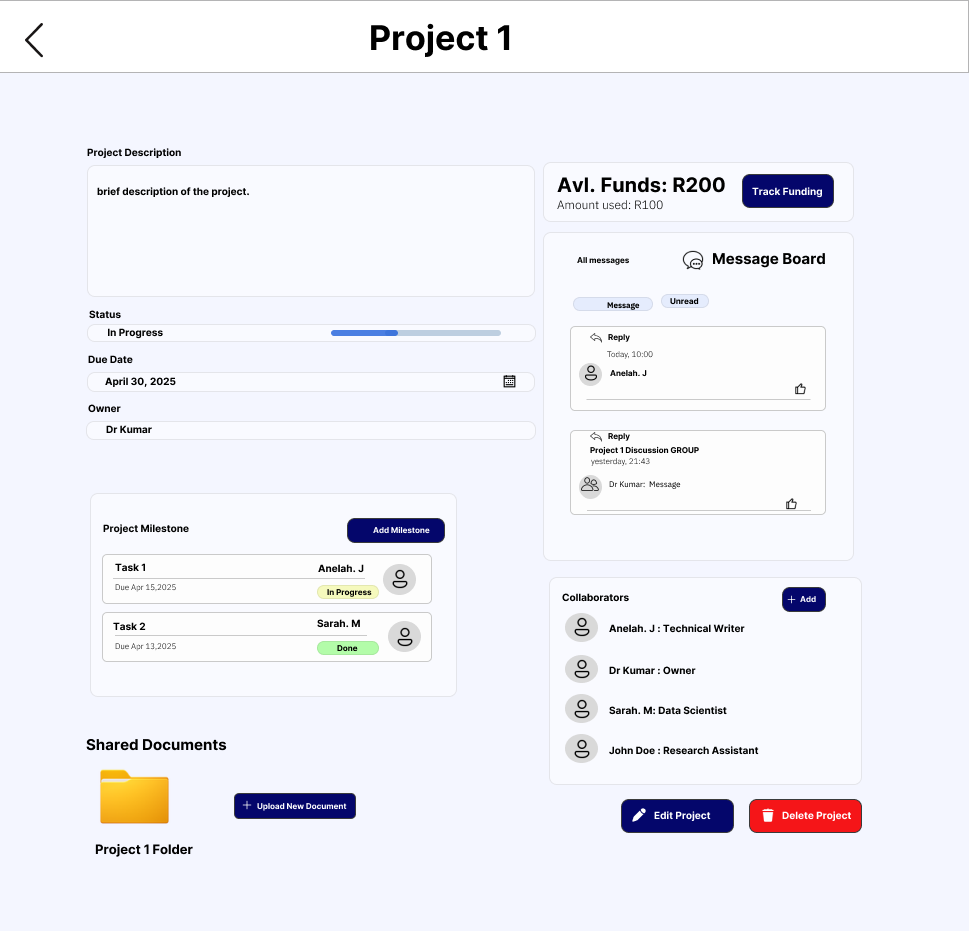  
  Project details view
- 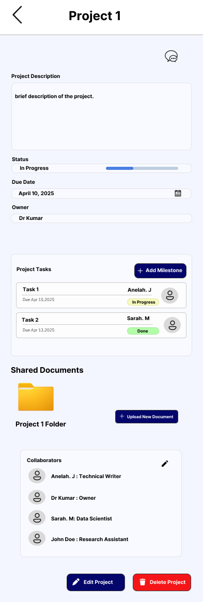  
  Mobile-responsive project details

## Reviewer Interface
- 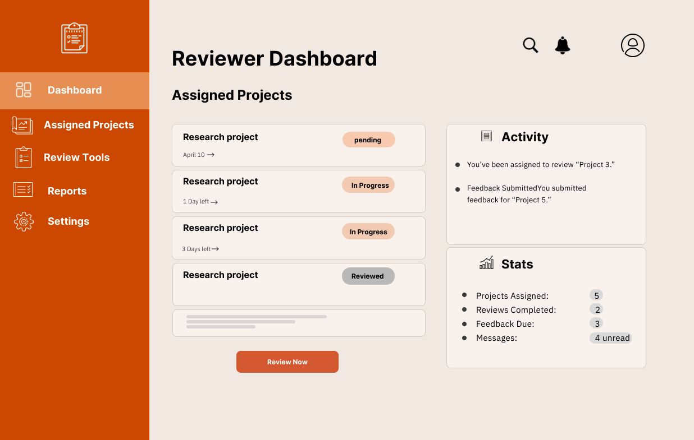  
  Main interface for project reviewers
- 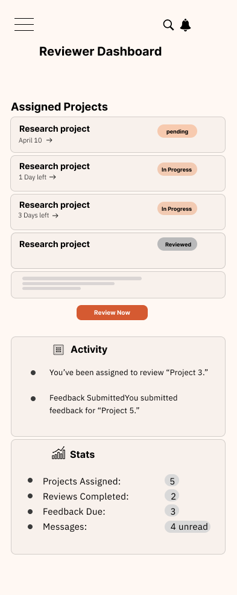  
  Mobile-optimized reviewer interface

## Document Management
- 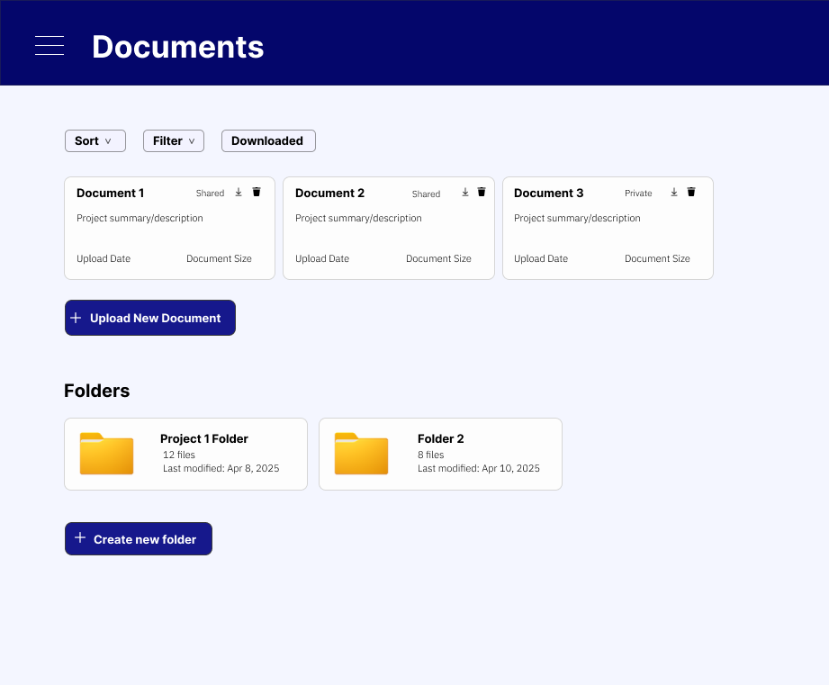  
  Document management interface
- 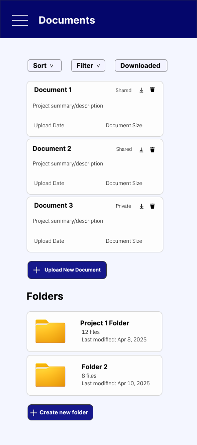  
  Mobile view for document management

## Project Funding
- 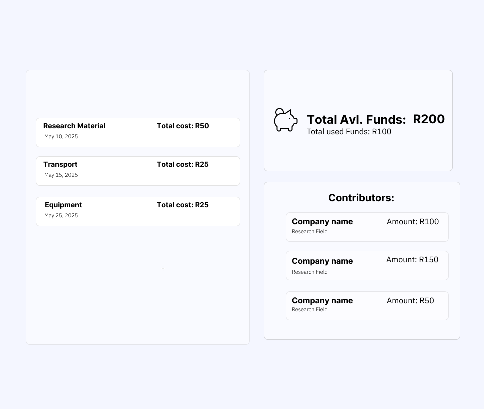  
  Funding tracking interface
- 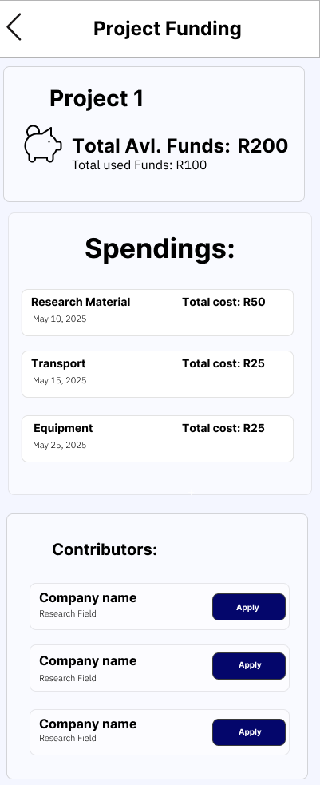  
  Mobile view for funding tracking

## User Account
- )  
  User profile account
-   
  Responsive layout for smaller screens

  ## Notifications
- 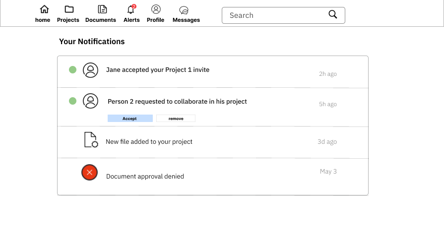 
-   
  Responsive layout for smaller screens

  ## Messages
-  
- 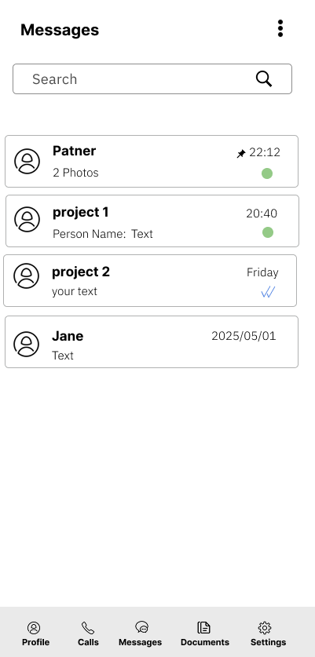  
- 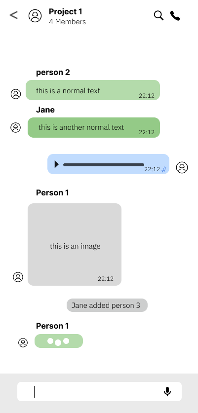 

