# University Research Collaboration Platform

## Introduction  
Researchers in universities often struggle to find collaborators for projects, manage shared resources, and track project progress.  
This project aims to create a **web-based research collaboration platform** that allows academics to **connect, share ideas, and manage their research work effectively**.

## Objectives  
The team is required to:  
- Use **Agile methodology**  
- Incorporate **CI/CD principles**  
- Take a **test-driven development (TDD) approach**  
- Develop and deploy a **publicly available** web application  

## Overview of Features  
- **Research Project Postings** – Create and manage project listings.  
- **Collaboration Tools** – Messaging, document sharing, and milestone tracking.  
- **Funding Tracking** – Manage research grants and expenditures.  
- **Reporting** – Generate key project and funding reports.  

## Detailed Requirements  

### User Verification  
- Use a **third-party identity provider** for authentication.  
- Three user roles:  
  - **Researcher** – Can create projects, invite collaborators, and manage research.  
  - **Reviewer** – Can review projects and provide feedback.  
  - **Admin** – Manages platform users and settings.  

### Project Management  
- Researchers can create **project listings**, define requirements, and invite collaborators.  

### Collaboration Tools  
- Built-in **messaging system**  
- **Document sharing** for research materials  
- **Milestone tracking** to monitor project progress  

### Funding Tracking  
- Researchers should be able to **track grants, spending, and funding needs**.  

### Reporting  
At least three **dashboard reports**:  
1. **Project Completion Status**  
2. **Funding Used vs. Available**  
3. **Custom View**  
- Reports should be **exportable as CSV or PDF**.  

### Bonus Features  
- **AI-powered collaborator recommendation** based on research interests and expertise.  

## Tech Stack  
- **Frontend**: React + Vite  
- **Backend**: Node.js (Express or FastAPI)  
- **Database**: PostgreSQL / Firebase  
- **Authentication**: OAuth (Google, ORCID, or institution-based login)  
- **CI/CD**: GitHub Actions  

## Installation  

### Prerequisites  
Make sure you have the following installed:  
- **Node.js** (>=16.x)  
- **npm** or **yarn**  
- **Git**  

### Setup  
1. Clone the repository:  
   ```sh
   git clone https://github.com/p4ntomath/SD_Project

# THESE ARE THE DESIGNS FOR THE PAGES:

## Researcher Dashboard
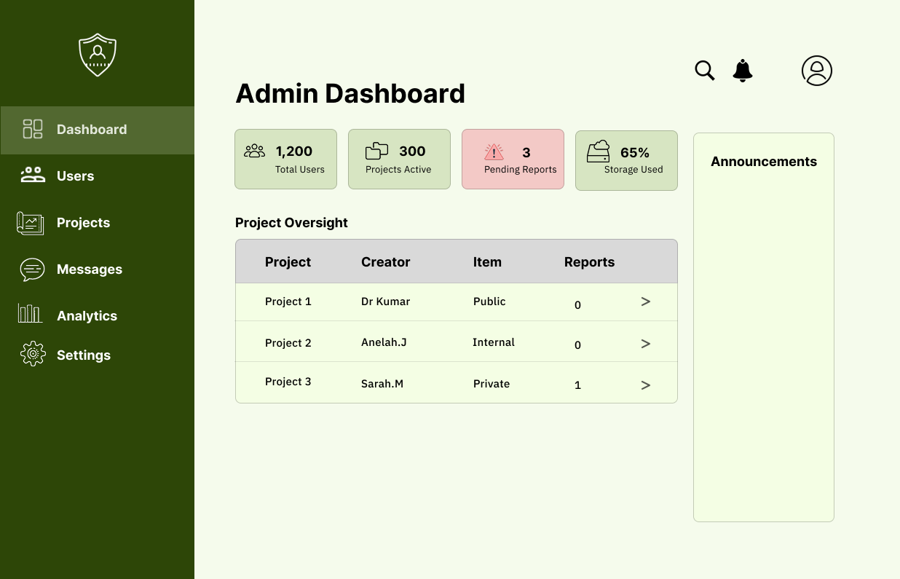

## Admin Dashboard


## admin Dashboard Small Screen
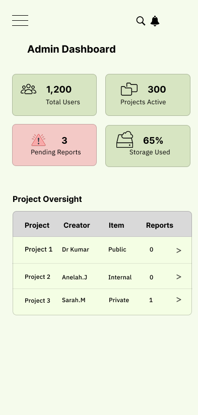

## create Project Page
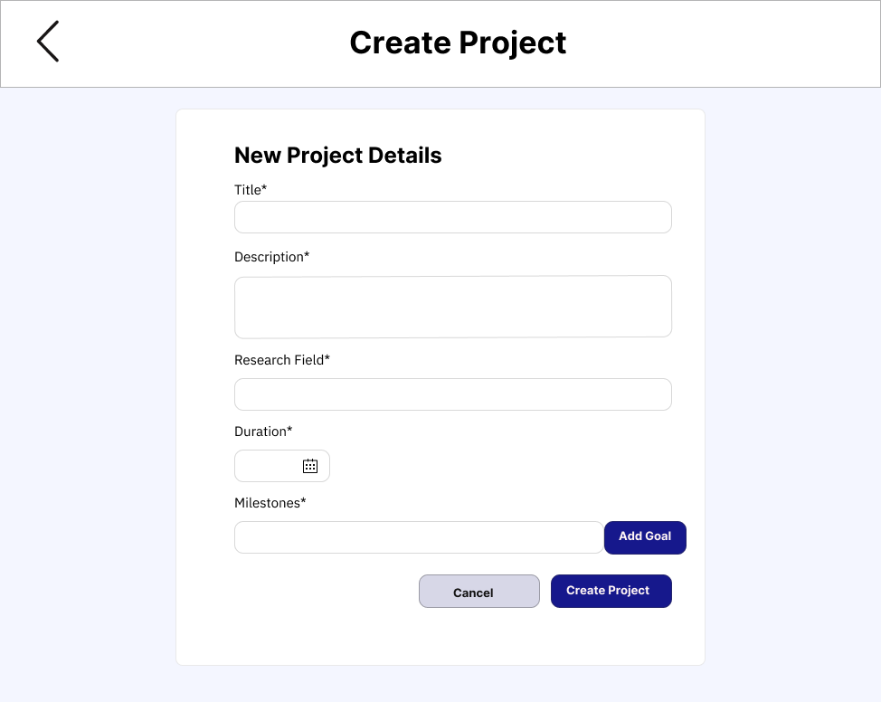

## create Project Page Small Screen
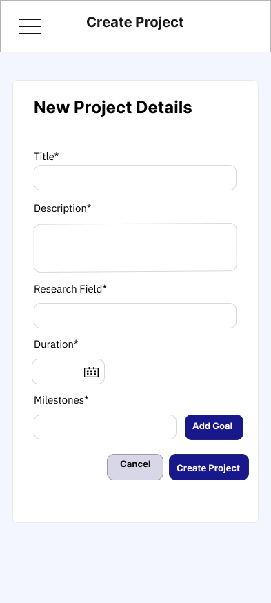

## Documents
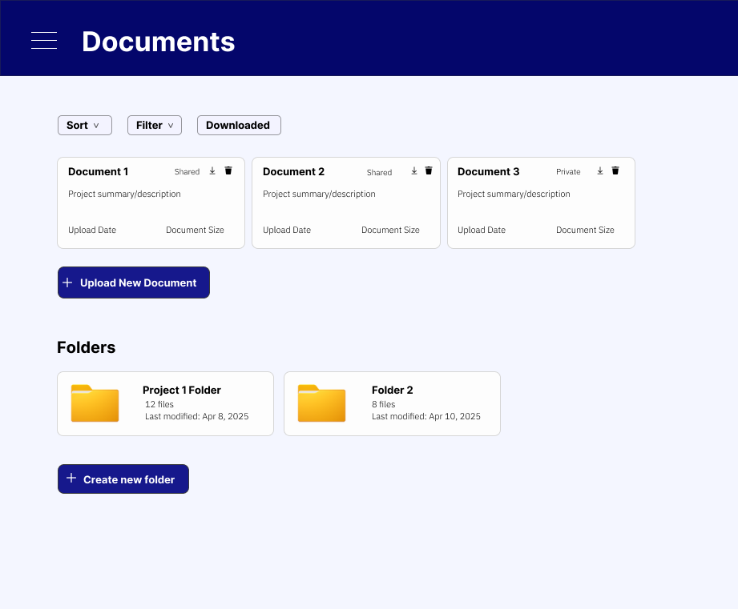

## documents Small Screen
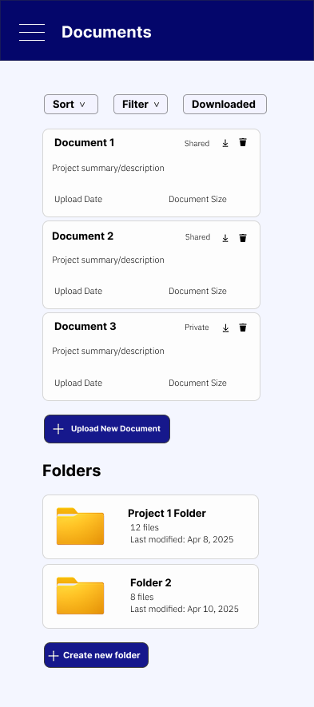

## myProfile
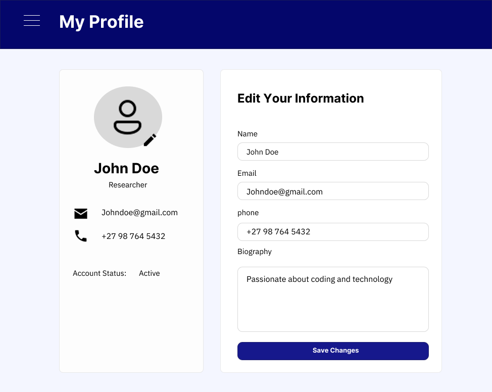

## myProfile Small Screen
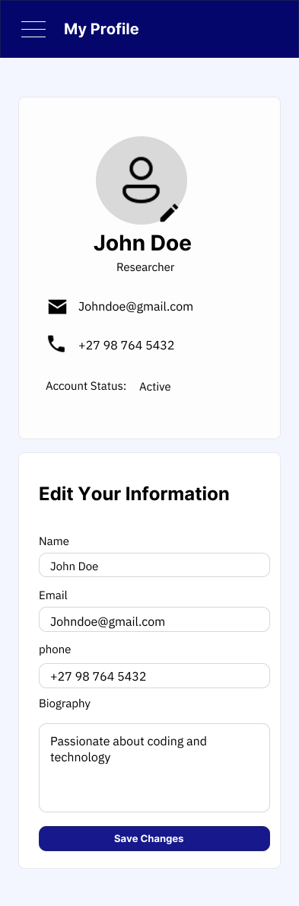

## Researcher Dashboard version 2
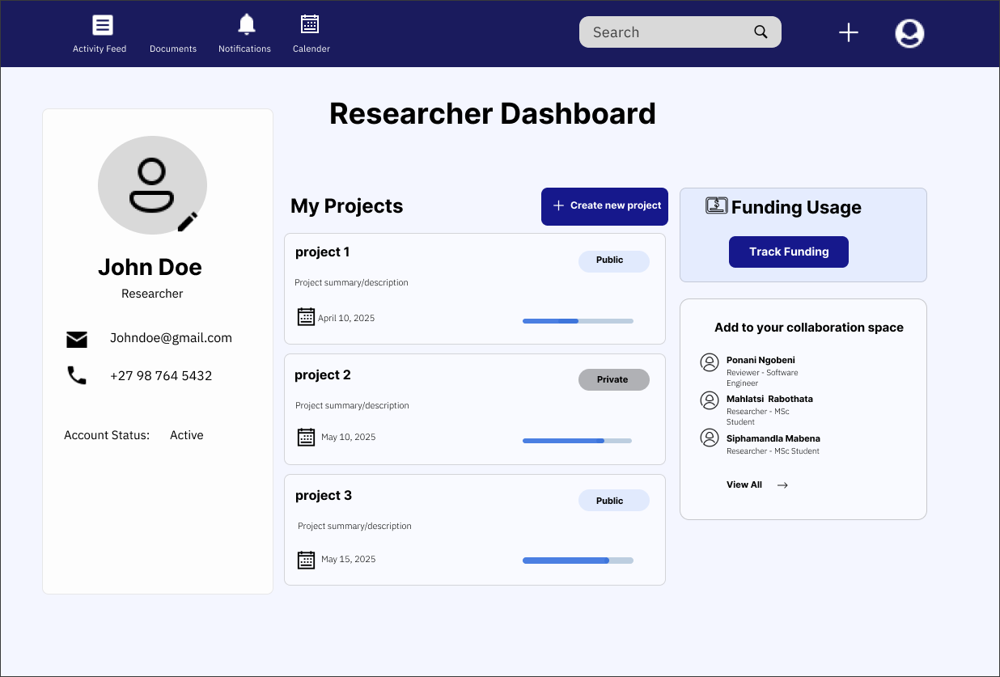

## reviewer Dashboard
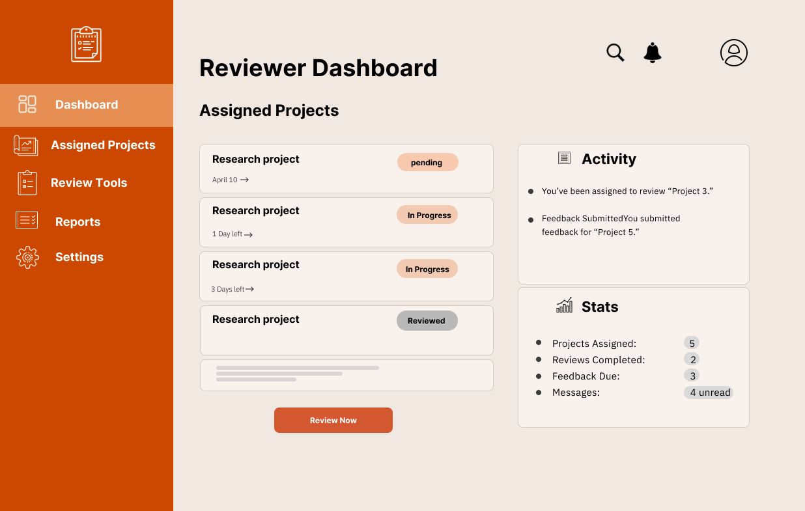

## reviewer Dashboard Small Screen
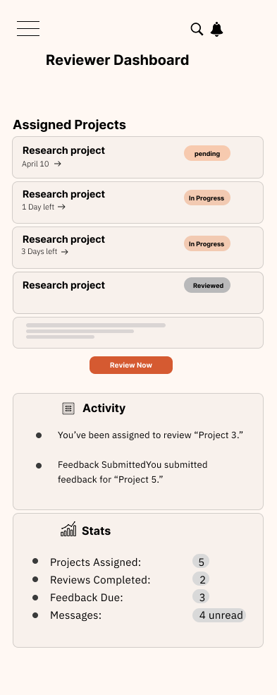

## track Project Funding Page
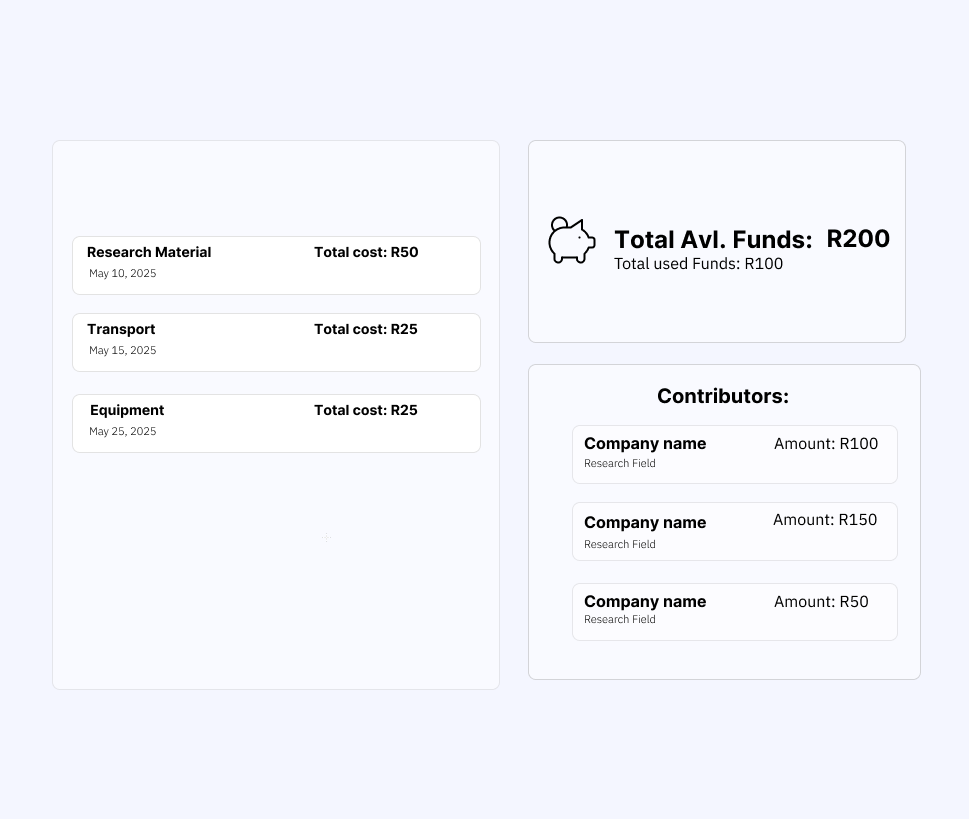

## track Project Funding Page Small Screen
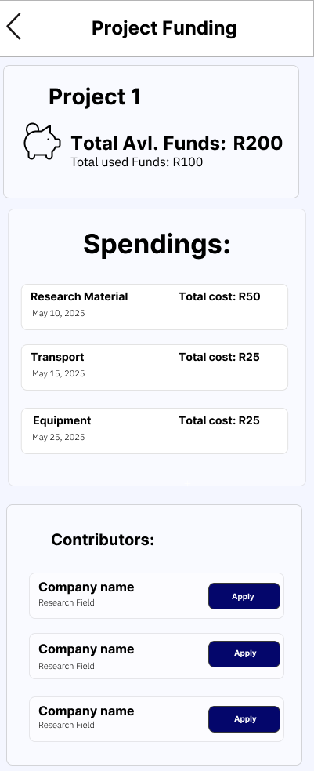

## view Project Page
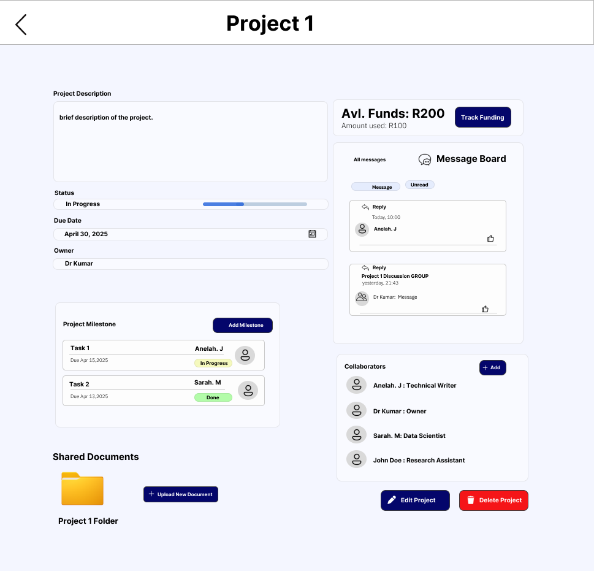

## view Project Page Small Screen
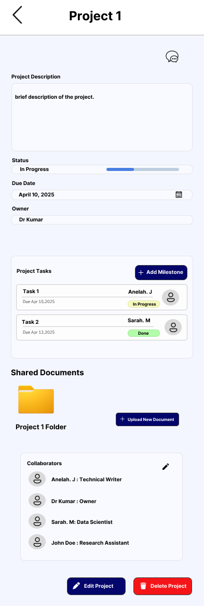


